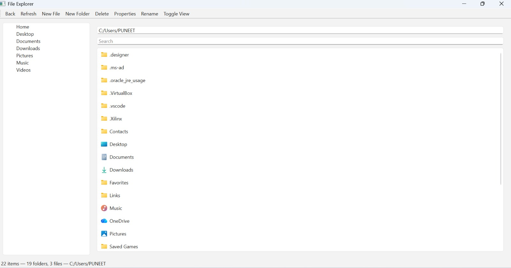
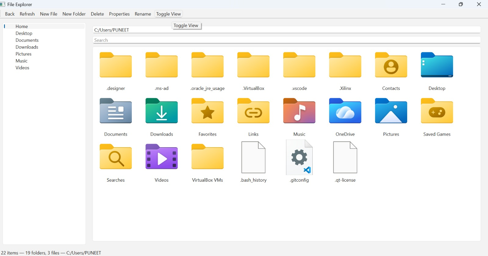
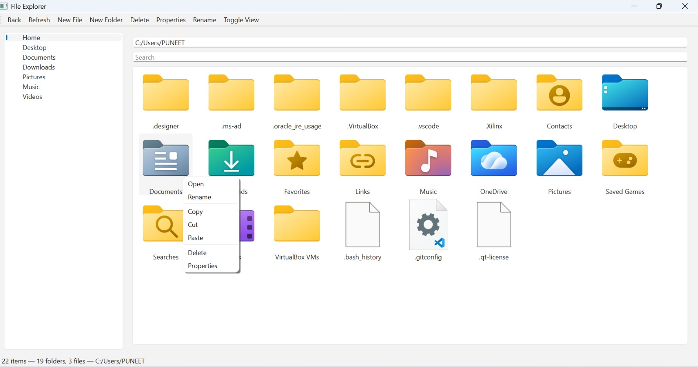
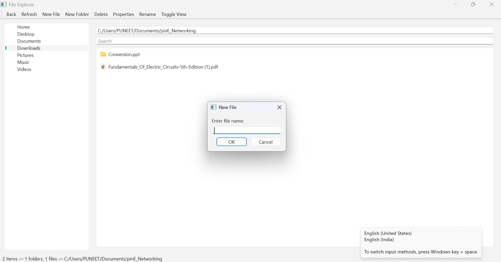
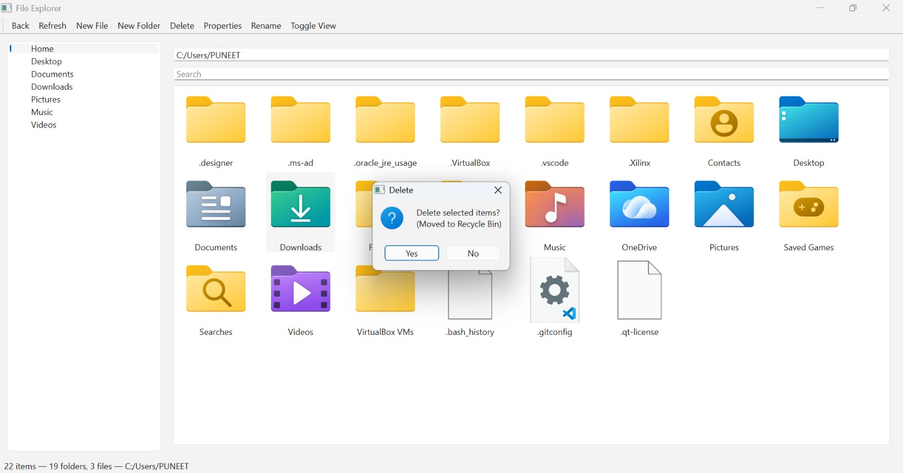
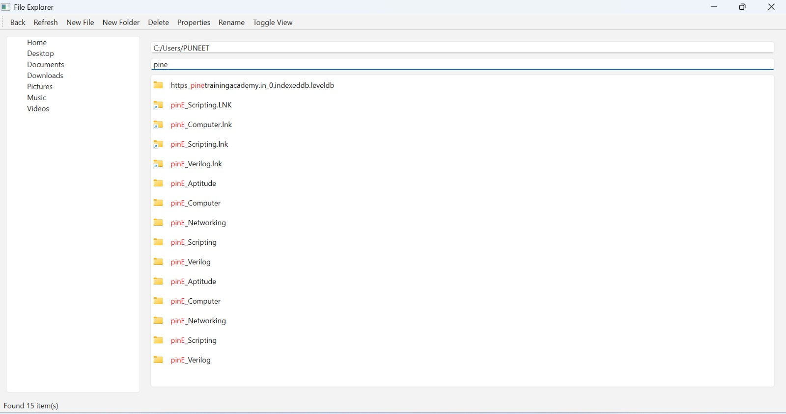
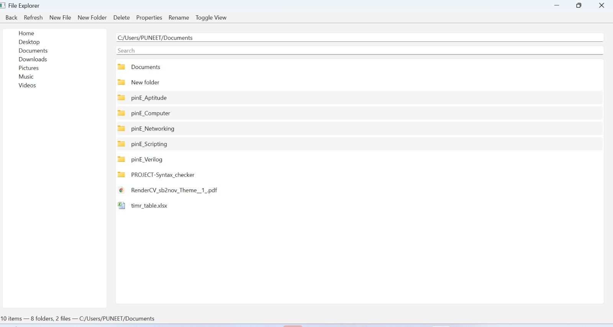

# 📁 Qt File Explorer

A modern **desktop file explorer application** built using **C++ and Qt 6**, designed to provide an intuitive and efficient way to browse, manage, and manipulate files and folders through a graphical user interface.

---

## 🚀 Project Overview

**Qt File Explorer** is a GUI-based desktop application developed using **C++ and Qt 6**.  
The primary goal of this project is to offer users a **simple, fast, and user-friendly file management system** that supports common file operations such as browsing, copying, deleting, renaming, and viewing file properties.

The application uses Qt’s powerful **Model-View architecture**, ensuring smooth interaction with the underlying file system while maintaining a clean separation between logic and presentation.

---

## ✨ Main Features

- 📂 Browse files and folders using a **tree view**
- 🖱️ Open files and directories via **double-click**
- ➕ Create new files and folders in the current directory
- ❌ Delete files and folders safely
- ✏️ Rename files and folders
- 📋 Copy, cut, and paste files/folders
- ⌨️ Keyboard shortcuts for faster operations
- ⬅️ Navigate back to the previous directory
- ℹ️ View file and folder properties:
  - Name
  - Location
  - Type (file/folder)
  - Size
  - Last modified date

---

## 🛠️ Technologies Used

- **Programming Language:** C++
- **Framework:** Qt 6
- **Qt Modules:**
  - Qt Widgets
  - QFileSystemModel
  - QFile
  - QDir
  - Qt Core
- **IDE:** Qt Creator

---
---

## 📸 Screenshots

### 🗂️ Main Window
Displays the main file explorer interface with directory navigation.

---

### 🔁 Toggle View
Switch between list view and icon/grid view.

---

### 🖱️ Right Click Menu
Context menu providing quick file operations.

---

### 📄 Create New File
Dialog box to create a new file in the current directory.

---

### 📁 Create New Folder
Dialog box to create a new folder.

---

### ❌ Delete Operation
Confirmation dialog shown during file/folder deletion.

---

### 🔍 Search Operation
Search functionality to locate files and folders.

---

### ☑️ Multiple Select
Selecting multiple files/folders for batch operations.

---

## ▶️ How to Run the Project

1. Open **Qt Creator**
2. Open the project using the `.pro` file
3. Select a **Qt 6 Kit**
4. Build and run the application

---

## 🎨 Design Highlights

- Implemented using **Model-View architecture** with `QFileSystemModel`
- Clean separation of **UI and logic**
- Efficient handling of file system operations
- Context-aware menus for file actions
- Recursive directory traversal support
- Action-based menus for improved usability
- Real-time updates using model-index mapping

---

## 🔮 Future Enhancements

- 📑 Tab support for opening multiple directories
- 🌙 Dark mode support
- 🖼️ File preview for text and image files
- 🖱️ Drag-and-drop file operations
- 📦 ZIP and UNZIP functionality
- ↩️ Undo and Redo support for file operations
- 🖼️ Thumbnail view for images and videos

---

## 📌 Conclusion

Qt File Explorer demonstrates effective use of **C++ and Qt** to build a robust desktop application.  
It highlights practical knowledge of **file systems, GUI programming, and object-oriented design**, making it a solid project for learning and showcasing desktop application development skills.

---

⭐ *If you like this project, feel free to star the repository!*

